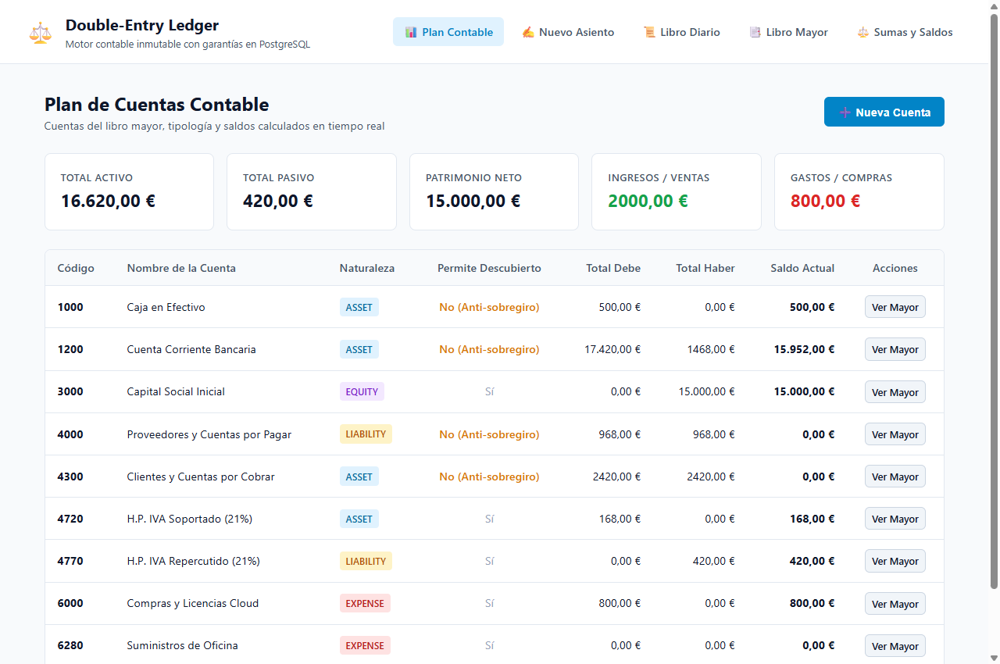
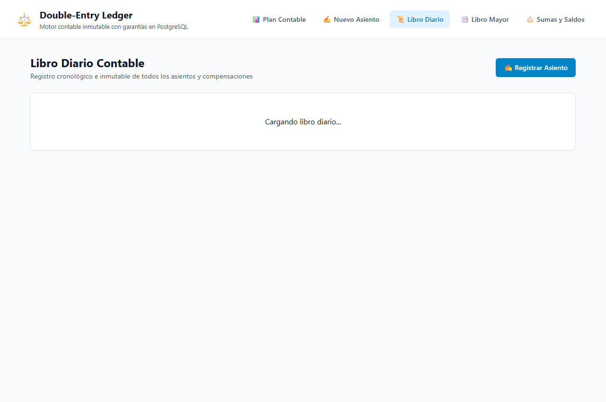
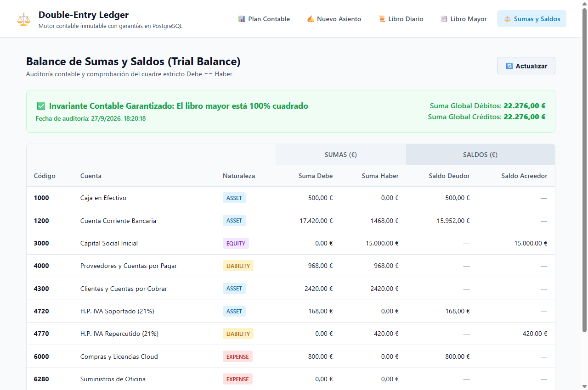

# Double-Entry Ledger · FastAPI + Asyncpg + PostgreSQL + React

[](https://github.com/jimmyrom1/double-entry-ledger/actions/workflows/ci.yml)

Motor contable transaccional e inmutable por partida doble con garantías de integridad garantizadas
directamente en PostgreSQL: regla de suma cero mediante constraint trigger diferido, inmutabilidad
estricta contra modificaciones o borrados, bloqueos pesimistas ordenados anti-deadlock para evitar
descubiertos concurrentes, idempotencia nativa y auditoría en tiempo real con balance de sumas y saldos.



| Libro Diario (Asientos y Reversiones) | Balance de Sumas y Saldos (Trial Balance) |
| --- | --- |
|  |  |

## Stack

| Capa | Tecnología |
| --- | --- |
| API | Python 3.12, FastAPI, Pydantic v2 (validación estricta con core en Rust), asyncpg (driver binario asíncrono de alto rendimiento sin ORM) |
| Base de datos | PostgreSQL 16 (triggers de inmutabilidad, constraint triggers `DEFERRABLE INITIALLY DEFERRED`, bloqueos `FOR UPDATE` ordenados) |
| Frontend | React 19, TypeScript, Vite, React Router |
| Calidad | pytest + pytest-asyncio (cobertura >85%), Vitest + Testing Library, Ruff, oxlint |
| Infraestructura | Docker Compose (PostgreSQL 16 + Uvicorn + Nginx), GitHub Actions CI |

## Arrancar en un minuto

```bash
docker compose up --build
```

Abre <http://localhost:8080>. El contenedor de PostgreSQL levanta el esquema, las funciones y los triggers automáticamente, y se cargan las cuentas y asientos de demostración.

## Decisiones técnicas

Estas son las partes en las que merece la pena fijarse:

- **Invariante contable de suma cero garantizado por PostgreSQL.**
  En contabilidad por partida doble, ningún asiento puede descuadrarse: la suma de débitos debe ser exactamente igual a la suma de créditos ($\sum Debe = \sum Haber$). En lugar de confiar únicamente en validaciones de aplicación, la regla se blinda en la base de datos con un **constraint trigger** en PostgreSQL (`trg_check_transaction_balanced`) con modo `DEFERRABLE INITIALLY DEFERRED`. Las líneas de un asiento se van insertando durante la transacción y PostgreSQL pospone la validación hasta el momento exacto del `COMMIT`. Si la suma no es exactamente cero o contiene menos de 2 líneas, la base de datos aborta la transacción y hace `ROLLBACK` automático.
- **Inmutabilidad estricta y compensación contable.**
  Los libros contables reales son append-only: nunca se hace `UPDATE` ni `DELETE` de un apunte ya registrado.
  - Se configuraron triggers en PostgreSQL (`BEFORE UPDATE OR DELETE ON postings`) que lanzan una excepción de integridad inmediata si alguien o algún script intenta alterar o borrar líneas del libro mayor.
  - Para corregir un asiento erróneo, la API proporciona un endpoint de reversión (`POST /api/transactions/:id/reversal`) que genera de forma atómica una transacción compensatoria inversa (invirtiendo Debe por Haber) y marca el estado del asiento original como `REVERSED`.
- **Prevención de descubiertos concurrentes sin condiciones de carrera (Race Conditions).**
  Si dos transferencias intentan retirar fondos de una cuenta con saldo limitado a la vez:
  - El servicio adquiere un bloqueo de fila pesimista en PostgreSQL:
    `SELECT ... FROM accounts WHERE id = ANY($1) ORDER BY id ASC FOR UPDATE`.
  - El `ORDER BY id ASC` garantiza que dos transacciones simultáneas que involucren las mismas cuentas en orden inverso jamás provoquen un bloqueo mutuo (**Deadlock** en PostgreSQL, código `40P01`).
  - Si una cuenta tiene `allow_negative = FALSE` (como cuentas de caja o tesorería protegida), el servicio verifica el saldo resultante dentro de la transacción bloqueada. Si el saldo resultante fuese negativo, la operación se rechaza inmediatamente con `422 Unprocessable Content`.
  - Un test de concurrencia real dispara 10 corrutinas asíncronas simultáneas compitiendo por retirar fondos limitados: exactamente 3 triunfan y 7 son rechazadas, terminando la cuenta con saldo positivo exacto sin un solo céntimo de descubierto.
- **Idempotencia nativa.**
  Cada transacción exige una clave de idempotencia (`Idempotency-Key` en cabecera o cuerpo) con restricción `UNIQUE` en PostgreSQL. Si la red falla y el cliente reintenta la misma petición, la API detecta la clave existente y devuelve el asiento original con código `200 OK` y cabecera `X-Idempotent-Replay: true`, impidiendo duplicar cobros o pagos.
- **Driver binario asíncrono puro (`asyncpg`) sin sobrecarga de ORM.**
  Para este servicio se descartó un ORM tradicional síncrono en favor de `asyncpg`. Esto permite consultas parametrizadas directas, control exhaustivo de transacciones concurrentes, soporte nativo de tipos `NUMERIC` con `Decimal` de Python y latencias de ejecución inferiores al milisegundo.
- **Auditoría continua con Balance de Sumas y Saldos (Trial Balance).**
  Un endpoint específico (`/api/reports/trial-balance`) agrega el Debe y Haber acumulado de todo el catálogo contable y calcula los saldos deudores y acreedores, verificando que $\sum Saldos Deudores == \sum Saldos Acreedores$ en cualquier momento temporal.

### Bugs reales que salieron probando

1. **Incompatibilidad de scopes en `pytest-asyncio` 1.4:** Al usar una fixture de inicialización de esquema con `scope="session"`, el plugin arrojaba un error de discordancia de event loops (`ScopeMismatch`). Se solucionó encapsulando la inicialización en una rutina síncrona gestionada con `asyncio.run()`, permitiendo que cada test gestione de forma aislada sus conexiones dentro del loop de función.
2. **Columnas ambiguas en vistas unidas (`AmbiguousColumnError`):** Al consultar la vista `account_balances` haciendo un `JOIN` adicional con `accounts`, asyncpg rechazaba la consulta por colisión en el nombre del campo `code`. La solución limpia fue incluir `created_at` directamente dentro de la proyección de `account_balances`, eliminando por completo el `JOIN` redundante y acelerando las lecturas.
3. **Coma final en argumentos de funciones SQL (`PostgresSyntaxError`):** En Python es común dejar comas al final de tuplas o argumentos multilínea (`COALESCE(SUM(...), 0,)`). Sin embargo, el parser SQL de PostgreSQL no admite comas previas al cierre de paréntesis `)`, lanzando un error de sintaxis en tiempo de ejecución. Se corrigió el formateo de las consultas SQL parametrizadas.
4. **Discrepancias de formato regional de moneda en Windows:** Al probar `Intl.NumberFormat` con el locale `es-ES` en entornos Node sobre Windows, las cantidades menores a 10.000 se formateaban sin punto de millar (`1250,50 €` en lugar de `1.250,50 €`). Se actualizó el test unitario con una expresión regular tolerante a la presencia o ausencia opcional del punto separador.
5. **Orden de inicialización del esquema en contenedor Docker:** En el arranque contenerizado con Docker Compose, el script de seed (`python -m app.seed`) se disparaba antes del servidor web, intentando comprobar la existencia de cuentas previas sobre una base de datos recién creada donde aún no existían las tablas (`ERROR: relation 'accounts' does not exist`). Se resolvió incorporando `init_schema(pool)` y un bucle de reintento con backoff en el punto de entrada de `seed.py`.

## API

| Método | Ruta | Descripción |
| --- | --- | --- |
| `GET` | `/api/health` | Estado del servicio y conexión a la base de datos |
| `GET` / `POST` | `/api/accounts` | Listar catálogo de cuentas con saldos en vivo / Crear cuenta |
| `GET` | `/api/accounts/:id` | Detalle y saldo acumulado de una cuenta |
| `GET` | `/api/accounts/:id/statement` | Extracto de cuenta (libro mayor con saldo cronológico acumulado) |
| `GET` / `POST` | `/api/transactions` | Libro diario de asientos / Registrar asiento de doble partida |
| `GET` | `/api/transactions/:id` | Detalle de un asiento y desglose de apuntes contables |
| `POST` | `/api/transactions/:id/reversal` | Revertir un asiento mediante apunte compensatorio inverso |
| `GET` | `/api/reports/trial-balance` | Balance de sumas y saldos para verificación de cuadre |

Ejemplo de registro de asiento contable:

```bash
curl -X POST http://localhost:8080/api/transactions \
  -H 'Content-Type: application/json' \
  -H 'Idempotency-Key: tx-demo-101' \
  -d '{
        "idempotency_key": "tx-demo-101",
        "description": "Pago de suministros por banco",
        "postings": [
          {"account_id": 10, "direction": "DEBIT", "amount": 150.00},
          {"account_id": 2, "direction": "CREDIT", "amount": 150.00}
        ]
      }'
```

## Desarrollo local (sin Docker)

Requisitos: Python 3.12, Node 24+ y PostgreSQL 16.

```bash
# 1. Base de datos
psql -U app -d subscriptions_test -c "CREATE SCHEMA IF NOT EXISTS ledger; CREATE SCHEMA IF NOT EXISTS ledger_test;"

# 2. Backend (FastAPI + Asyncpg) → http://localhost:8000
cd backend
python -m venv .venv && source .venv/bin/activate   # En Windows: .venv\Scripts\activate
pip install -r requirements-dev.txt
cp .env.example .env
python -m app.seed                                 # Inicializa esquema y carga datos demo
uvicorn app.main:app --reload --port 8000

# 3. Frontend (React + Vite) → http://localhost:5173
cd ../frontend
npm install
npm run dev
```

## Tests

```bash
# Tests de Backend (concurrencia, inmutabilidad, triggers y API)
cd backend  && pytest -v --cov=app --cov-report=term-missing

# Tests de Frontend (cálculos monetarios, balance checker y UI)
cd frontend && npm test
```

La CI ejecuta en cada push:
1. Lint, formato con Ruff y tests del backend con cobertura contra un servicio real de PostgreSQL 16.
2. Lint con oxlint, chequeo de tipos con TypeScript (`tsc -b`), tests con Vitest y build del frontend.
3. Smoke test que levanta el stack completo con Docker Compose y verifica la salud de la API, la integridad del balance y el enrutado de la SPA a través de Nginx.

## Estructura

```
backend/
  app/
    main.py             # Aplicación FastAPI, lifespan y middlewares
    config.py           # Configuración con pydantic-settings
    db.py               # Pool de conexiones asyncpg e inicialización de esquema
    models.py           # Modelos Pydantic v2 (validación estricta y DTOs)
    service.py          # Lógica contable, bloqueos FOR UPDATE y anti-descubierto
    schemas.sql         # Esquema DDL, vistas de saldo y triggers de inmutabilidad/suma cero
    seed.py             # Script de población de cuentas y transacciones demo
    routes/
      accounts.py       # Endpoints de cuentas y extractos de libro mayor
      transactions.py   # Endpoints de transacciones, idempotencia y reversiones
      reports.py        # Endpoints de balance de sumas y saldos
  tests/
    conftest.py         # Fixtures de BD aisladas
    test_accounts.py    # Tests de cuentas y duplicados
    test_transactions.py# Tests de transacciones, balances y reversión
    test_concurrency.py # Tests de carreras en descubiertos y anti-deadlock
    test_immutability.py# Tests de triggers de inmutabilidad y suma cero en BD
    test_reports.py     # Tests de balance de comprobación y extractos
frontend/
  src/
    api.ts              # Cliente HTTP tipado con manejo de errores
    types.ts            # Interfaces TypeScript de cuentas, transacciones y balances
    money.ts            # Formateo y utilidades monetarias
    components/         # Navbar, BalanceChecker
    pages/              # Plan de cuentas, Nuevo asiento, Libro diario, Mayor, Sumas y saldos
docker-compose.yml
```

## Qué añadiría después

- Exportación del libro diario y balance de comprobación a formato Excel (`.xlsx`) y PDF.
- Cierre de ejercicio contable automático (asiento de regularización de pérdidas y ganancias).
- Multi-divisa con tipo de cambio histórico fijado en el momento del asiento.

## Otros proyectos

Forma parte de una serie de proyectos con el mismo enfoque: reglas de negocio garantizadas
por la base de datos o por funciones puras, tests que prueban los casos difíciles y CI en cada push.

| Proyecto | Qué es |
| --- | --- |
| [Rate Limiter & Circuit Breaker gRPC](https://github.com/jimmyrom1/rate-limiter-grpc) | Microservicio en Go + gRPC + Protocol Buffers: control de tráfico (~90 ns/op) con Token Bucket, Sliding Window, Leaky Bucket y Circuit Breaker. |
| [Subscriptions API](https://github.com/jimmyrom1/subscriptions-api) | API REST con Java 21 y Spring Boot 4: prorrateo, facturación idempotente, ShedLock, Flyway y Testcontainers. |
| [Reserva de salas](https://github.com/jimmyrom1/room-booking) | Flask + PostgreSQL + React: reservas sin solapes garantizadas por un `EXCLUDE` de PostgreSQL, JWT y exportación a calendario. |
| [Mini Facturas](https://github.com/jimmyrom1/mini-invoice-generator) | Flask + PostgreSQL + React: IVA por línea con desglose, retención de IRPF, numeración correlativa atómica y exportación a PDF. |
| [LoL Tracker API](https://github.com/jimmyrom1/lol-tracker-api) | Backend en Node.js 24 + TypeScript + Fastify: proxy de la API de Riot con caché compartida en PostgreSQL, límite de peticiones y la key solo en el servidor. |
| [LoL Tracker](https://github.com/jimmyrom1/lol-tracker) | App Android nativa: Kotlin, Jetpack Compose, Room, Hilt, multimódulo e importación de partidas desde la API de Riot. |


## Licencia

MIT
